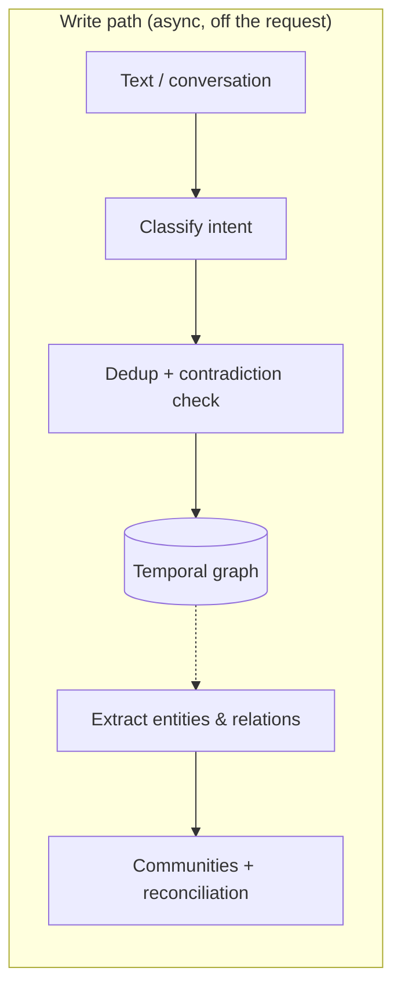
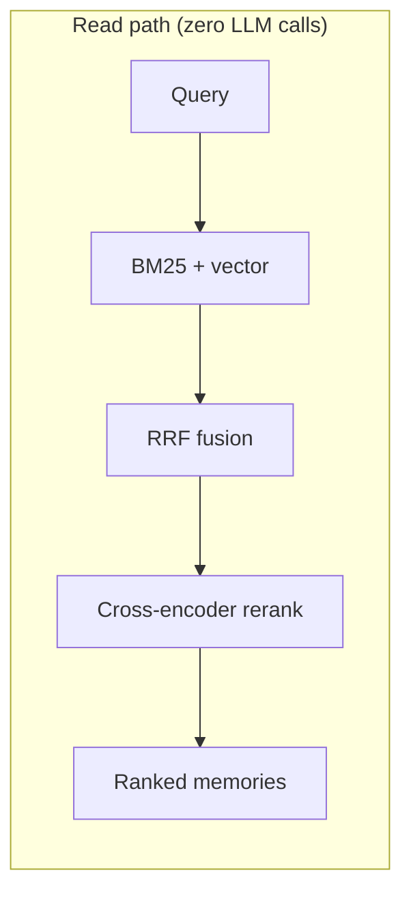

<div align="center">

<h1>Cortadel™</h1>

<h3><em>Long-term memory for AI agents — a temporal knowledge graph, not a vector blob.</em></h3>

<p>
  <strong>MCP</strong> · <strong>REST</strong> · <strong>dashboard</strong>, in one self-hosted container on <strong>.NET 10</strong> — backed by <strong>FalkorDB</strong> or <strong>Memgraph</strong>.
</p>

<p>
  <strong>Temporal graph</strong> · nothing is overwritten &nbsp;·&nbsp;
  <strong>Self-reconciling</strong> · merges its own duplicates &nbsp;·&nbsp;
  <strong>Reranked</strong> · local cross-encoder &nbsp;·&nbsp;
  <strong>Zero-LLM reads</strong>
</p>

<p>
  <a href="LICENSE"></a>
  
  
  
  
</p>

<p>
  <a href="docs/getting-started.md"><b>Quickstart</b></a> &nbsp;·&nbsp;
  <a href="docs/self-hosting.md"><b>Self-hosting</b></a> &nbsp;·&nbsp;
  <a href="docs/mcp.md"><b>MCP</b></a> &nbsp;·&nbsp;
  <a href="docs/sdk-dotnet.md"><b>.NET SDK</b></a> &nbsp;·&nbsp;
  <a href="docs/"><b>Docs</b></a> &nbsp;·&nbsp;
  <a href="https://cortadel.ai"><b>Website</b></a>
</p>

</div>

---

<div align="center">

**Your AI forgets everything between sessions. Cortadel remembers — and reasons over what changed.**

</div>

Cortadel automatically extracts facts from conversations, links them into a **bi-temporal knowledge graph**, resolves contradictions, merges duplicate entities, forgets what's stale, and hands your agent the right context — in milliseconds, with **no LLM call on the read path**. Memory, graph, and reranked retrieval in one system, on your own infrastructure.

> **Status — early access.** This repository is Cortadel's **open extension surface**: the official **SDK, docs, and examples** (Apache-2.0). The Cortadel **server** (memory engine + dashboard) is the product, shipped as a container image — see [Self-hosting](docs/self-hosting.md). A **TypeScript SDK** is written in this repo (not yet published to npm); a **Python** SDK is on the roadmap.

|  |  |
|---|---|
| 🧠 **Temporal graph memory** | Facts, entities, and their relationships — with *when* each was true. Bi-temporal: edits **supersede**, never overwrite, so history stays queryable. |
| ✍️ **Intent-aware writes** | "Remember X", "forget X", "X is resolved" all do the right thing. A five-verb pipeline (store / invalidate / delete / touch / resolve), not append-only. |
| 🔍 **Hybrid retrieval + reranker** | BM25 + vector fused with RRF, then a **local cross-encoder** (bge-reranker-v2-m3). All enrichment happens at write time; reads make **zero LLM calls**. |
| 🧩 **Self-reconciling graph** | A reversible, human-in-the-loop engine **merges duplicate entities and supersedes stale ones** — with an LLM judge, auto-approve, and a review UI. Nothing else in the field does this. |
| 🌐 **Communities** | Hierarchical **Louvain** communities (and cross-user shared ones) summarize what your graph *means*, not just what it stores. |
| 🔌 **Two ways in** | A typed **REST API** and a **Model Context Protocol** endpoint — Claude, Cursor, or your own agent connect with zero glue. |
| 📦 **One container** | API + MCP + dashboard in a single .NET 10 process over **FalkorDB** or **Memgraph**. Lossless per-user **backup / export / import**. |

Built **.NET-first** — the production-grade agent-memory engine the .NET ecosystem was missing.

## Why Cortadel is *different*

Most "AI memory" is a vector store with an LLM stapled on top. Cortadel is a **memory engine**:

- **It remembers *when*, not just *what*.** Every fact and edge is bi-temporal. Ask "what did we believe on June 1?" and get the answer as of that date — contradictions are invalidated, not deleted.
- **It curates itself.** Duplicate entities get merged, renamed things get superseded, and every automatic decision is **reversible** and reviewable. Your graph gets *cleaner* over time instead of noisier.
- **It's fast where it counts.** The expensive work (extraction, dedup, enrichment, embeddings, community detection) runs **at write time, off the request path**. Retrieval is BM25 + vector + RRF + a local reranker with **no LLM in the loop** — so recall stays sharp and latency stays low.
- **It's yours.** Self-hosted, inspectable behavior, dual graph backends, and a data model you can **export losslessly** and move. No managed black box required.

## *Benchmarks*

Retrieval quality on the two standard conversational-memory benchmarks, measured by a **reproducible in-repo harness** on **local models** (self-hosted embeddings + local cross-encoder):

| Benchmark | Metric | Raw fusion | + Cross-encoder rerank |
|---|---|---|---|
| **LongMemEval** | Recall@5 · @10 · @20 | 75.2 · 80.8 · 89.6 | **93.0 · 95.0 · 98.0** |
| **LongMemEval** | MRR | 0.652 | **0.872** |
| **LoCoMo** | Recall@5 · MRR | — | **92.3 · 0.839** |

> **Honest by default.** These are **retrieval-recall** numbers from a harness you can run yourself, on local models — *not* LLM-judged answer accuracy on a managed cloud stack. That's a different (and easier-to-inflate) axis; we report the reproducible one. Your mileage scales with your embedding and reranker models.

## How Cortadel *compares*

A capability view of the self-hostable OSS memory systems, from a code-grounded review of each project's source (Aug 2026):

| Capability | **Cortadel** | mem0 (OSS) | Graphiti | cognee | Supermemory |
|---|:---:|:---:|:---:|:---:|:---:|
| Self-hostable engine (inspectable source) | ✅ | ✅ | ✅ | ✅ | ❌ closed binary |
| Native graph store | ✅ Falkor + Memgraph | ❌ removed in v2 | ✅ | ✅ | 🟡 closed |
| Bi-temporal (valid + transaction time) | ✅ | ❌ platform-only | ✅ | 🟡 | 🟡 |
| Intent-aware writes (remember / forget / resolve) | ✅ 5 verbs | ❌ add-only | ❌ | ❌ | 🟡 managed |
| Dedup + contradiction handling | ✅ vector + LLM + negation guard | 🟡 hash-only | ✅ | 🟡 id-only | 🟡 managed |
| Reversible entity reconciliation + review UI | ✅ | ❌ | ❌ | ❌ | ❌ |
| Hierarchical + cross-user communities | ✅ Louvain L0/L1 | ❌ | 🟡 single-level | ❌ | ❌ |
| Local cross-encoder reranker (default-on) | ✅ | ❌ | 🟡 optional | ❌ | 🟡 managed |
| Zero-LLM read path | ✅ | ✅ | ✅ | 🟡 | ✅ |
| Lossless backup / export / import | ✅ | 🟡 platform | 🟡 | 🟡 | 🟡 |
| **.NET / C# native** | ✅ | ❌ | ❌ | ❌ | ❌ |
| Published SDKs | ✅ .NET on NuGet · 🟡 TypeScript written, not yet published (Py planned) | ✅ Py + TS | 🟡 Py | 🟡 Py | ✅ TS + Py |
| Framework integrations & connectors | 🟡 MCP + Claude Code | ✅ | 🟡 | 🟡 Slack | ✅ Drive/Notion/… |
| Managed cloud | 🟡 Cloud (coming) | ✅ | ❌ | ✅ | ✅ |

<sub>✅ first-class · 🟡 partial / optional / managed-only · ❌ not available. Competitors genuinely lead on **reach** — SDK breadth, framework integrations, connectors, and managed cloud — which Cortadel is actively closing. mem0 moved its graph store, temporal reasoning, and decay to its managed platform in OSS v2/v3; Supermemory's engine ships as a closed binary, so its engine cells reflect its public API contract, not inspectable code.</sub>

## Who it's *for*

<table>
<tr>
<td width="33%" valign="top">

### 🤖 I build agents

Give any MCP-capable agent (Claude, Cursor, your own) durable memory with **zero code** — point it at the endpoint.

**[→ MCP integration](docs/mcp.md)**

</td>
<td width="33%" valign="top">

### 🟣 I'm on .NET

The agent-memory engine built **for your stack**. Install the typed SDK and you're three lines from remember + recall.

**[→ .NET SDK](docs/sdk-dotnet.md)**

</td>
<td width="33%" valign="top">

### 🖥️ I self-host

Your memory, your box. **One container**, a graph DB, and an embedding provider — no managed cloud required.

**[→ Self-hosting](docs/self-hosting.md)**

</td>
</tr>
</table>

## *Quick start*

**1 · Run the server.** The fastest path is the **batteries-included** compose — graph DB, embeddings, and an LLM all bundled, running on CPU (no GPU needed):

```bash
curl -O https://raw.githubusercontent.com/cortadel/cortadel/main/docker-compose.yml
docker compose up   # dashboard http://localhost:3001 · REST /api/v1 · MCP /mcp/{client}/{userId}
```

Or just the server (bring your own graph DB + providers — see [Self-hosting](docs/self-hosting.md)):

```bash
docker run -p 3001:3001 ghcr.io/cortadel/cortadel:latest
```

**2 · Connect an agent (no code)** — point any MCP client at:

```
http://localhost:3001/mcp/claude/alice
```

**…or use the .NET SDK:**

```bash
dotnet add package Cortadel.Sdk
```

```csharp
using Cortadel.Sdk;

using var cortadel = new CortadelClient("http://localhost:3001", userId: "alice");

// Remember
await cortadel.AddAsync("Alice prefers dark mode and ships on Fridays.");

// Recall — hybrid search, reranked, zero LLM calls on the read path
var hits = await cortadel.SearchAsync("what are alice's working preferences?", new() { TopK = 5 });
foreach (var h in hits.Results)
    Console.WriteLine($"{h.RrfScore:F2}  {h.Content}");
```

**…or hit the REST API directly:**

```bash
curl -X POST http://localhost:3001/api/v1/memories \
  -H "content-type: application/json" \
  -d '{"userId":"alice","text":"Alice prefers dark mode."}'
```

Full walkthrough: [Getting started](docs/getting-started.md) · runnable [example](examples/dotnet-quickstart/).

## MCP tools

One Streamable-HTTP endpoint — `http://<host>:3001/mcp/{clientName}/{userId}`:

```json
{
  "mcpServers": {
    "cortadel": {
      "url": "http://localhost:3001/mcp/claude/alice",
      "headers": { "Authorization": "Bearer <token>" }
    }
  }
}
```

| Tool | What it does |
|---|---|
| `add_memories` | Store memories (intent-aware: remember / forget / resolve). |
| `add_conversation` | Distill atomic facts from a transcript and store them. |
| `search_memory` | Hybrid search (BM25 + vector + RRF, optional rerank). |
| `get_skill` | Retrieve a learned procedural skill. |
| `reconcile_memories` · `reconcile_status` · `list_merge_suggestions` | Drive and review entity reconciliation. |
| `add_media` | Ingest an image/document (multimodal). |

Works with **Claude Desktop · Cursor · Windsurf · VS Code · Claude Code** and any MCP-aware client. See [MCP integration](docs/mcp.md).

## How it *works*

Expensive work happens once, at write time. Reads stay fast and LLM-free.





## What's in this repo

| Path | What |
|---|---|
| [`sdk/dotnet`](sdk/dotnet) | Official **.NET SDK** (`Cortadel.Sdk`) — a thin, typed client over the REST API |
| [`sdk/typescript`](sdk/typescript) | Official **TypeScript SDK** (`@cortadel/sdk`) — a thin, typed client over the REST API (written, not yet published to npm) |
| [`docs`](docs) | Getting started · authentication · self-hosting · MCP · SDK reference |
| [`examples`](examples) | Runnable samples |

*Coming:* npm publish of the TypeScript SDK, a Python SDK, a connector API, and a community-integrations registry.

## Documentation

- [Getting started](docs/getting-started.md)
- [Authentication](docs/authentication.md)
- [Self-hosting the server](docs/self-hosting.md)
- [MCP integration](docs/mcp.md)
- [.NET SDK reference](docs/sdk-dotnet.md)
- [TypeScript SDK reference](docs/sdk-typescript.md)

## Licensing

- **This repo** — SDK, docs, and examples — is **Apache-2.0**. Use it freely.
- **The Cortadel server** (engine + dashboard container) is **free to self-host for personal and development use**; a **commercial license** is required for business use. Managed **Cortadel Cloud** is coming — see [cortadel.ai](https://cortadel.ai).

---

<div align="center">
<sub>Built with .NET 10 · Apache-2.0 SDK · <a href="https://cortadel.ai">cortadel.ai</a></sub>
</div>
